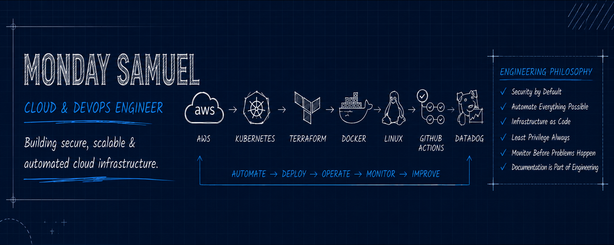

# 👋 Hi, I'm Monday Samuel

## Cloud & DevOps Engineer

> **Building secure, scalable and automated cloud infrastructure.**

I'm passionate about designing cloud infrastructure that is secure by default, automated through Infrastructure as Code, and built for reliability.

My interests span AWS, Linux, Kubernetes, automation, and cloud security. Every project in this profile represents hands-on engineering work, complete with documentation, architectural decisions, implementation details, challenges encountered, and lessons learned.

---

## 🚀 Core Technologies

---

## 📂 Featured Engineering Projects

| Project | Description |
|---------|-------------|
| 🛡 Ubuntu Server Hardening | Linux security hardening, SSH security, PAM, MFA, auditing, firewall configuration, Fail2Ban, and system hardening. |
| ☁ AWS Three-Tier Banking Application | Production-style cloud deployment using Terraform, Amazon EKS, GitHub Actions, Argo CD, Amazon ECR, and Kubernetes. |
| 🏗 Terraform Infrastructure | Infrastructure as Code projects for provisioning secure AWS environments. |
| 🐳 Docker Projects | Containerization and multi-container deployments using Docker and Docker Compose. |
| ☸ Kubernetes Projects | Kubernetes deployments, services, ingress, scaling, and GitOps workflows. |
| 🔐 Bash Security Automation | Bash scripts for automating Linux hardening and security auditing. |

---

## 🧠 Engineering Principles

✔ Security by Default

✔ Infrastructure as Code

✔ Automate Repetitive Tasks

✔ Least Privilege Access

✔ Monitor Before Problems Happen

✔ Documentation is Part of Engineering

---

## 📈 GitHub Statistics

<!-- GitHub Stats -->

---

## 🤝 Let's Connect

📧 **Email**

mondaysammy2005@gmail.com

💼 **LinkedIn**

www.linkedin.com/in/mondaysam

---

> *Engineering reliable cloud platforms through automation, security, and Infrastructure as Code.*
